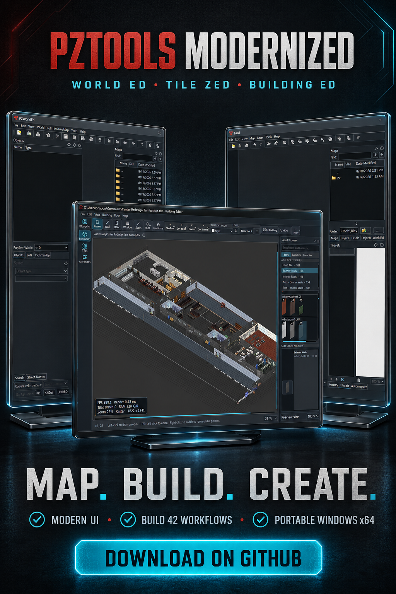

# PZTools Unofficial

An unofficial, maintained Qt 5 edition of the Project Zomboid mapping tools:
**WorldEd**, **TileZed**, and **BuildingEd**.

This repository continues the work in Tim Baker's
[pzworlded](https://github.com/timbaker/pzworlded) and
[tiled](https://github.com/timbaker/tiled) repositories. It starts from the
upstream `basements` work, preserves basement and negative-level support, and
adds a portable Windows distribution, native 256-cell workflows, image editing,
mapping automation, stability fixes, and current Project Zomboid data support.

This is a community project. It is not an official The Indie Stone release.
Project Zomboid game assets are not included.

## Modernized version and project history

The original WorldEd and TileZed tools were created by **Tim Baker**. This
version is based on the later community-maintained work in
[Unjammer/PZ_Mapping_Tools](https://github.com/Unjammer/PZ_Mapping_Tools) and
retains the features, fixes, and documentation developed there. This repository
adds a modernized interface and further compatibility, rendering, validation,
and usability improvements for current Project Zomboid mapping workflows.

### Modernized UI and additional changes

- refreshed BuildingEd interface behavior for current Qt 5 workflows;
- a larger **New Building** dialog that keeps the template, width, and height
  controls visible, including with Breeze Dark and Qt 5.14.2;
- corrected transparent-tile rendering so fully transparent cells appear as
  valid blank tiles instead of red missing-tile placeholders;
- improved BuildingEd template and furniture validation that distinguishes
  transparent cells from genuinely missing or unloaded tilesets;
- corrected BuildingEd asset previews, category and furniture views, map
  rendering, and hit-testing;
- matching transparent-tile handling in WorldEd when rendering and selecting
  building tiles; and
- a portable Windows x64 release with the required executables and Qt runtime.

This is an independently maintained community modernization. Credit for the
original applications and upstream development remains with their respective
authors and contributors. The automatically generated GitHub **Source code** archives do not contain the
Windows executables.

Current release documentation: [August 8, 2026 changes](RELEASE_CHANGELOG.md),
[feature reference](docs/Feature-Reference.md), and
[logs/diagnostics](docs/Diagnostics-and-Logs.md).

## August 7 and 8, 2026 update at a glance

The latest two-day integration pass focuses on renderer performance, useful
live diagnostics, safer conversion, and frequently requested editor workflow
improvements:

- BuildingEd now coalesces hidden Iso, Tile, and Properties scene updates,
  batches layer visibility synchronization, and applies the accumulated work
  only when a view becomes visible. This removes redundant floor-switch work
  without changing complete tileset preload or the established renderer.
