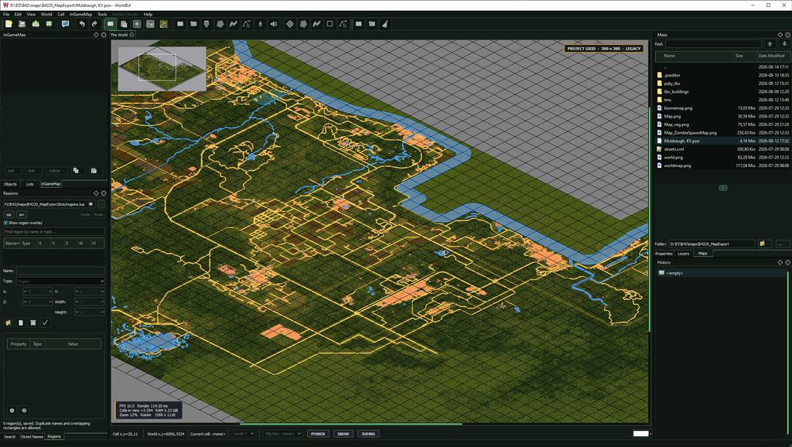

# PZTools Unofficial

PZTools Unofficial is a maintained Qt edition of the Project Zomboid mapping
tools. It includes **PZWorldEd**, **TileZed**, and **BuildingEd**.

The project continues the work in Tim Baker's
[pzworlded](https://github.com/timbaker/pzworlded) and
[tiled](https://github.com/timbaker/tiled) repositories. It preserves basement
and negative-level support and adds current Build 42 mapping workflows,
portable configuration, native 256-cell support, image editing, mapping
automation, compatibility corrections, and safer project maintenance.

Tim Baker created the original WorldEd and TileZed foundation. The current
unofficial Qt 5 continuation, maintenance, new features, and fixes are developed
by **Alree / Unjammer**, except where a change has another explicitly recorded
provenance.

This is a community project. It is not an official The Indie Stone release.
Project Zomboid game assets are not included.

- [Current release changes](RELEASE_CHANGELOG.md)
- [Documentation](DOCUMENTATION.md)
- [Troubleshooting FAQ](docs/FAQ.md)
- [Feature reference](docs/Feature-Reference.md)
- [Feature provenance](FEATURE_PROVENANCE.md)
- [Upstream history](UPSTREAM-HISTORY.md)
- [Build instructions](BUILDING.md)



## Included applications

### PZWorldEd

PZWorldEd manages PZW projects, cells, lots, roads, zones, world-map data,
terrain images, Biomemap data, Zombie Heatmaps, WorldGen definitions, OSM
terrain imports, and LOT generation.

Important additions include:

- Native256 projects with one source cell mapped to one output cell
- Partial Chunks mode for selecting the 8 x 8-square chunks included in a
  Native256 LOT export
- BMP-to-TMX validation, optional repair, and Rules/Blends metadata-only synchronization
- Hole Detection based on actual tile presence
- Optional hole filling during LOT generation
- Project Doctor for paths, missing tilesets, and project cleanup
- Build 42.20 Biomemap reference and separate red and green painting modes
- WorldGen biome, feature, and static-prefab editing
- OpenStreetMap project generation with terrain, vegetation, buildings,
  streets, roads, markings, and typed zones
- Regions and Street Names editors
- InGameMap Forest export with the Forest pyramid and strict Build 42.20
  binary-header validation before existing files are replaced
- InGameMap building outlines from both placed TBX lots and RoomDefs embedded
  directly in cell TMX maps
- Non-destructive `worldmap.xml` and `worldmap-forest.xml` overlays in the
  World view
- Structured editing of Build 42.20 `worldmap-annotations.lua` text symbols
  from the first entry in **InGameMap**, the annotation button on the main
  toolbar, or **Ctrl+Alt+A**
- Basement entrance placement preview and visual access picker
- Vertical building-lot placement with selected underground outlines and a
  confirmed ground-opening action for basement stairs

### TileZed

TileZed edits TMX maps, terrain layers, objects, RoomDefs, TileDefs, depth
geometry, Automapper rules, procedural loot, and texture packs.

Important additions include:

- Complete recursive tileset discovery with 2x, 1x, and custom sources
- Dockable BMP and Brush windows with saved placement
- Rules and Blends replacement for older embedded TMX snapshots
- Indexed Rules and Blends brush updates with sparse dirty-region processing
- Exact rule-tile resolution when similarly named custom or test sheets exist
- Safe, undoable tileset removal with MiniMap synchronization and automatic
  Rules and Blends layer rebuilding
- Layer-aware and floor-aware tile selection
- Copy and cut immediately switch tile selections to a translucent,
  pointer-following preview. One click places every selected layer and level.
- Stamp and Fill previews retain their tilesets until the preview is replaced
  or cleared, including when Undo removes a newly introduced tileset from the
  TMX.
- Partial Chunks mode shared with WorldEd for Native256 TMX maps
- Depth Map primitive editing with pixel dimensions and reusable presets
- TileDef comparison and Snow, Burnt, and custom replacement editing
- Fast pack extraction for individual tiles, tilesets, and multi-tile objects
- Optional orphan-pixel cleanup during extraction
- Lua mapping tools with transactional Undo
- BuildingEd actions and TBX opening launch the standalone `BuildingEd`
  process. TileZed does not host a second embedded editor.
- Narrow Tilesets docks retain every command through the toolbar overflow
  menu.

### BuildingEd

BuildingEd creates and edits TBX buildings, rooms, floors, walls, roofs,
objects, furniture, basements, and negative levels.

TBX is an optional authoring and reuse format. A valid TMX can contain its
buildings and all placed tiles directly without retaining separate TBX files.

Important additions include:

- Complete tileset discovery shared with TileZed and WorldEd
- Layer-aware and floor-aware tile selection
- Copy and cut preserve RoomDefs and room layouts together with selected tile
  layers. Paste without a destination selection provides a translucent,
  click-to-place preview in the Ortho and isometric views.
- Copied RoomDefs are recreated as building-owned rooms during placement, so
  replacing the clipboard cannot invalidate pasted room floors.
- The placement preview uses a validated, immutable snapshot of copied tiles
  and rooms instead of traversing live clipboard grids on every mouse move.
- Pasting beyond an edge expands the building while preserving and shifting
  existing rooms, user tiles, square properties, objects, and basement access.
  One Undo restores the complete pre-paste state.
- Copy checkpoints the recoverable autosave when the document already contains
  unsaved changes. Timed autosave remains paused while a cut or paste
  transaction is incomplete and resumes only after the coherent final state is
  available.
- Preserved room-floor definitions across save and reopen
- Procedural-loot inspection and project overrides
- Lua building automation with transactional Undo
- Configurable autosave at 1, 5, 10, 20, or 60 minutes

## First setup

1. Extract the release to a writable directory.
2. Start any of the three applications.
3. Select the mapping **Tiles** directory that contains the PNG sheets.
4. Select the packaged `config` directory if it was not found automatically.
5. Optionally select the Project Zomboid installation in Preferences.

The shared Project Zomboid path can supply official TileDefs, texture packs,
WorldGen data, and procedural-loot definitions. It does not replace the
extracted mapping Tiles directory required by the renderers.

Basement access resources use the portable directory beside `bin`:

- `pzby_tbx/basement_access` for editable TBX and TMX sources
- `pzby_tbx/binmap` for compiled PZBY files

WorldEd searches both portable resource directories recursively and detects
files added while the application is running. A basement-access source does
not need to contain a staircase or a dedicated anchor. WorldEd displays the
complete TBX or TMX as a translucent overlay aligned to the Basement trace
origin. Right-click a selected Basement object and choose **Choose Basement
Access...** to browse the available access names with a visual preview.

Each application provides an autosave interval in Preferences. WorldEd and
TileZed save only an existing modified PZW or TMX. BuildingEd retains its
recoverable `.autosave` copy workflow. Untitled projects are never assigned a
path automatically. Copy checkpoints autosave when unsaved edits exist.
Autosave pauses during complete cut, paste, paint, and resize transactions and
resumes only after the document is coherent.

## Partial chunk LOT export

Native256 maps can use **Partial Chunks** when a cell should contain only a
small building, zone, or playable area. Open the cell TMX in TileZed or open
the WorldEd cell view, then use the dedicated **Partial Chunks** menu or
toolbar. The 256 x 256 cell remains the normal editing canvas while a 32 x 32
chunk grid shows the export mask.

Each grid square represents one complete 8 x 8-square game chunk. Click a
chunk to toggle it. Drag across the grid to select or clear a rectangular
group. The state of the starting chunk determines whether the dragged group
is included or omitted, and the overlay previews the result until release.
Included chunks use a light tint and omitted chunks are darkened. **Ctrl+A**
or **Select All Chunks** includes all 1024 chunks while the mode is active.
**Clear Chunk Selection** omits all of them. These actions select export
coverage, not the tiles inside the TMX, and do not delete or rewrite source
layers. The grid line and included-chunk tint use the existing **Grid color**
from Preferences, so WorldEd and TileZed can each display the mask in a
user-selected color.

**How Partial Chunks Works...** in either Partial Chunks menu shows the same
workflow and export rules inside the application. Disable the mode while
performing normal tile or object editing, then re-enable it before partial LOT
generation. The saved chunk choices are retained while the mode is disabled.

The selection is stored beside the TMX as `map-name.tmx.pzchunks`. Keep this file
with the TMX when moving or sharing the source project. A map without an
enabled sidecar retains conventional whole-cell behavior.

While Partial Chunks is enabled, Hole Detection and automatic hole filling
are disabled for that cell. Generate Lots writes selected chunks normally and
encodes omitted chunks as absent LOT data and null navigation chunks. RoomDefs,
room objects, used-tile headers, and zombie intensity are limited to the
selected chunks. A selected chunk may be empty by design. An omitted chunk is
absent from the exported LOT even if its TMX area contains tiles. This mode is
available only for Native256 projects.

In **Preferences > Window Setup**, **Use 1920 x 1080** immediately resizes and
centers only the current application. **Apply to Current Application** does the
same with the entered custom dimensions. **Apply to All Three Applications**
also starts the other two tools with that size. These actions are temporary and
the previous saved layouts return on the next normal start.

## World-map XML overlays

Open **View > World Map Overlays** to load `worldmap.xml` or
`worldmap-forest.xml` over the World view without importing their features
into the PZW. Loading `worldmap.xml` also loads an adjacent
`worldmap-forest.xml` when present. The two overlays can then be shown,
hidden, or cleared independently. Forest geometry is green. Buildings, water,
roads, railways, and other world-map geometry use distinct colors. Loaded
overlays are read-only and never change project data or exported files. The
overlay renderer spatially batches geometry and skips batches outside the
visible World view.

**InGameMap > Generate Building Features** detects placed TBX lots and
RoomDefs embedded directly in assigned cell TMX maps. Room rectangles are
merged into building outlines. Disconnected footprints remain separate and
negative basement levels are excluded from the surface outline.

**InGameMap > Create World Image** uses the packaged `MapToPNG.txt` color
rules. This file is different from terrain `Rules.txt`. The dialog selects the
packaged file by default and replaces an invalid remembered rules path.

## Tileset compatibility

All three applications discover valid PNG sheets recursively.

1. A readable 2x sheet is preferred.
2. A readable 1x or custom sheet is used when no 2x sheet exists.
3. A missing placeholder is used only when neither scale resolves.
4. One-scale-only sheets remain valid.
5. Nested official pack directories and custom directories are supported.

TMX files retain their complete ordered tileset headers. This is required for
older maps, adjacent cells with different `firstgid` values, and embedded BMP
rules that reference tiles not currently painted on a normal tile layer.

A fully transparent cell in a resolved sheet is valid and remains distinct
from a missing PNG. With **Show Invisible Tiles** enabled, transparent and
explicitly invisible tiles use a crossed-eye marker. Unresolved sources use a
separate red missing-source marker. Tile makers should assign the `invisible`
TileDef property to intentional transparent placeholders so Check Maps can
distinguish them from accidental empty artwork.

## Portable configuration

The Windows release keeps its writable state inside the extracted directory:

```text
PZTools-Qt5-Latest/
|-- bin/
|-- brushes/
|-- config/
|-- docs/
|-- licenses/
|-- lua/
|-- plugins/
|-- settings/
|-- themes/
`-- translations/
```

Preferences and logs are stored under `settings`. Logs include OS, CPU, RAM,
display-adapter, Qt, and process information useful for support without
recording a username, hostname, serial number, IP address, or stable machine
identifier.

Packaged themes are refreshed automatically when the release provides a newer
QSS definition. Built-in dark and colored themes also apply matching Qt
palette colors to application-drawn text, menus, selections, and tooltips.
BuildingEd welcome content, tileset lists, editable zoom controls, and tile
preview canvases follow the active dark palette unless the user selected a
custom tile-preview background color. High-contrast SVG artwork is used for
tools whose original black silhouettes were unreadable on dark backgrounds.
Additional QSS files placed in `themes` remain user-managed and are not
overwritten.

## Project safety

Guided repair and conversion tools show their inputs and outputs before
writing. Project Doctor begins with a read-only check. Destructive project
corrections create backups and use atomic file replacement where supported.
TMX tileset use is verified from raw GIDs even when a referenced PNG is
missing. TBX inspection is diagnostic only and never rewrites a building.
Game installation data is treated as a read-only source. Project overrides
belong in the mapper's project or mod directory.

## Why do unofficial mapping tools exist?

Public source does not automatically provide a usable current release. The
mapping community has repeatedly needed matching executables, configuration,
Tiles support, documentation, and corrections before complete official tools
were available. Community maintenance made current Build 42 formats usable by
active mappers and preserved workflows for long-lived projects.

This project exists to keep those tools practical, understandable, and
available. It remains open source so anyone can inspect it, improve it, or
maintain another build.

You're welcome. It was my pleasure.

## Documentation and issue reports

- [Documentation index](DOCUMENTATION.md)
- [Offline documentation home](docs/index.html)
- [Feature reference](docs/Feature-Reference.md)
- [Configuration files](docs/PZTools-Configuration-Files.md)
- [Project Doctor](docs/PZ-Project-Doctor-Tiles-and-Paths.md)
- [WorldGen editor](docs/PZ-B42.20-WorldGen-Editor-and-Prefabs.md)
- [Procedural loot editor](docs/PZ-B42.20-Procedural-Loot-Editor.md)
- [Pack comparator and extractor](docs/PZ-Pack-Comparator-and-Extractor.md)
- [TileDef tools](docs/PZ-TileDef-Comparator-and-Snow-Editor.md)
- [Logs and issue reports](docs/Diagnostics-and-Logs.md)
- [Feature provenance](FEATURE_PROVENANCE.md)
- [Upstream history](UPSTREAM-HISTORY.md)
- [Current release changes](RELEASE_CHANGELOG.md)

A useful issue report includes the application, release, exact steps, expected
and observed behavior, newest matching log, affected source files when they
can be shared, and a screenshot for visual problems.

## Building from source

The [build guide](BUILDING.md) describes the source layout and compilation for
Windows, Linux, and macOS. Windows x64 with Qt 5.14.2 and MSVC is the current
release target. Other platforms must be compiled with compatible Qt and native
toolchains.

## Credits and special thanks

- **Tim Baker** for the original WorldEd and TileZed work that remains the
  upstream foundation of these tools.
- **Alree / Unjammer** for the unofficial Qt 5 continuation, current
  maintenance, new features, fixes, integrations, and releases.
- The map-style import workflow is documented as existing since at least 2023
  with the [Google Maps Styling Wizard](https://mapstyle.withgoogle.com/) and
  custom JSON. It later evolved toward OpenStreetMap in the native tools.
- **SadPeanut / [Pz-RealLifeMap](https://github.com/SadPeanut/Pz-RealLifeMap)**
  for the idea of using OpenStreetMap instead of Google.
- A very special thank you to **Fred 'Military Surplus' Cooper**.
- **Petro**, **Pabbiqo [pq]**, **Dane**, **! Cacador**, **Kyber**,
  **shakaloblok**, and the Project Zomboid mapping and modding community for
  reproducible reports, project files, screenshots, logs, and practical
  workflow feedback.

Legal authorship and third-party attribution are documented in
`AUTHORS.txt`, `FEATURE_PROVENANCE.md`, `UPSTREAM-HISTORY.md`, and the bundled
license notices.

## Licenses and assets

PZWorldEd, TileZed, and BuildingEd retain their upstream copyright notices and
are distributed as modified GPL applications. `libtiled`, `tmxviewer`, Qt,
and other bundled components retain their own licenses.

The release includes `COPYING.txt`, `THIRD_PARTY_NOTICES.txt`,
`SOURCE-OFFER.txt`, `FEATURE_PROVENANCE.md`, `UPSTREAM-HISTORY.md`, and the complete `licenses`
directory. Corresponding source is published at
<https://github.com/Unjammer/PZ_Mapping_Tools>.

Project Zomboid data, Tiles, textures, and other game assets are not part of
this repository or release. Users must obtain them from an authorized game
installation and follow the game's modding and redistribution rules.
